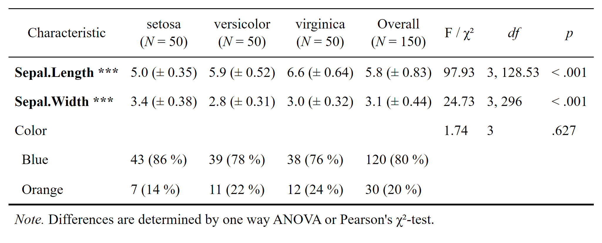
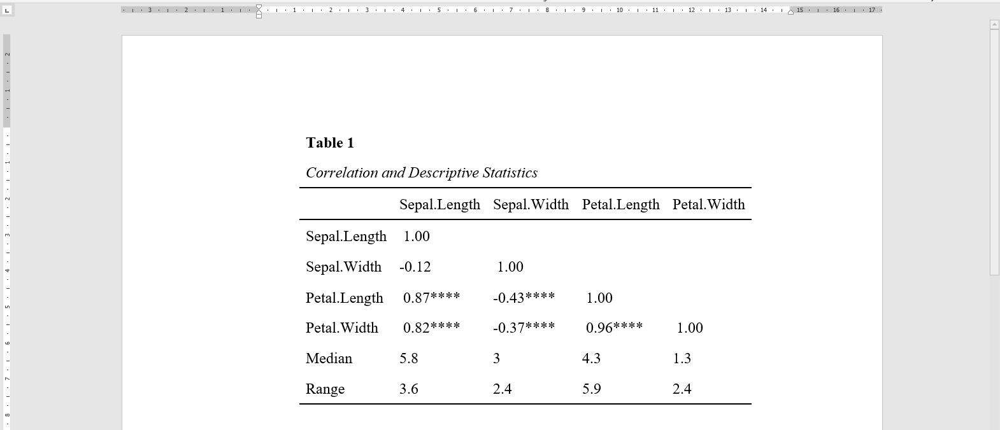
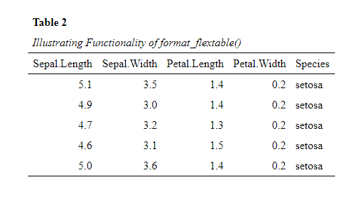
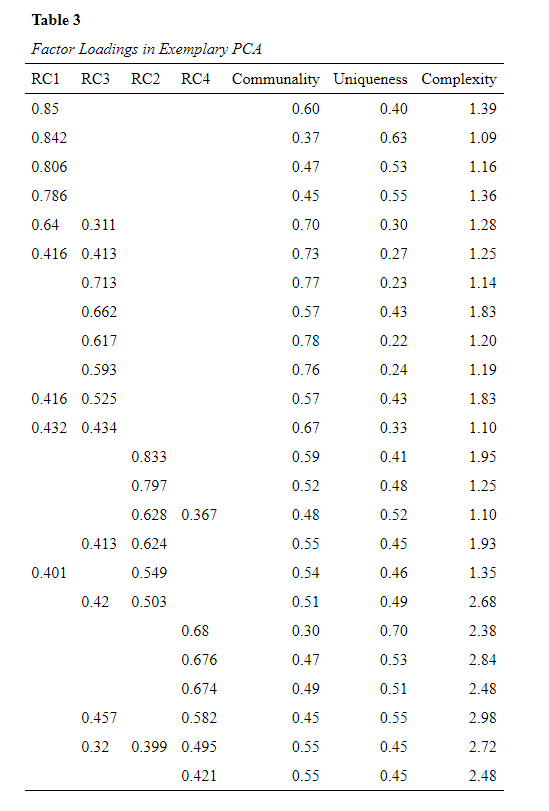

<!-- README.md is generated from README.Rmd. Please edit that file -->

# datscience R-Package

<!-- badges: start -->
<center>

[](https://github.com/Buedenbender/datscience/actions)
[](https://app.codecov.io/gh/Buedenbender/datscience?branch=main)
[](https://www.repostatus.org/#active)
[](https://choosealicense.com/licenses/mit/)
[](commits/main)
[](commits/main)

</center>
<!-- badges: end -->

The datscience (**dat**aanalysis and **science**) R-package contains
functions, which are frequently required in the process of preparing
data for publication. Among those are:

-   `format_flextable()` applies the APA 7th theme to a flextable object
-   `apa_factorLoadings()` creates APA 7th based factor-loadings table
-   `flex_table1()` tabular group comparison of 2 or more groups (usualy
    table 1)
-   `Rcitation_appendix()` Function that allows the creation of a full
    APA-style table with all citations and informations on the
    R-packages utilized.

The overall goal was to improve the workflow of data analysis and help
with formatting challenges I encountered in the preparation of
submission to scientific journals. For example: getting stats from R
with the right format into MS Word.

## Installation

You can install the latest released version of datscience easily,
directly from
[GitHub](https://github.com/Buedenbender/datscience#readme) with:

``` r
# Normal intsallation
install.packages("devtools")
devtools::install_github("Buedenbender/datscience")
```

My recommendation would be to use a the
[pacman](https://github.com/trinker/pacman) package manger instead, as
this installs the latest version from github and directly loads it

``` r
# Recommendation: pacman
pacman::p_load_gh("Buedenbender/datscience")
```

#### Installation Troubleshoot

Some users might encounter: `(System Error 267 @win/processx.c:1040)`,
which is due to special characters in the username and the path to the
directories (e.g., `ö` or `é`). In this case, you can try to install
`datscience` with the remotes package in standalone mode in a fresh
R-sessions (no packages loaded) (see below and for reference this
[stackoverflow posting](https://stackoverflow.com/q/68400661/7318488)).

``` r
Sys.setenv(R_REMOTES_STANDALONE="true")
remotes::install_github("Buedenbender/datscience")
```

### A Teaser of `datscience` Functionality: `flex_table1()`

While R provides so many opportunities and power to conduct whatever
analyses one can imagine, I found myself often having difficulties with
the transfer of the analysis or the results from R session into MS Word.

**Example Problem:** Get a *nicely* formatted (in accordance with APA
7th publication manual) sociodemographic table 1 directly into a Word
file (\*.docx).

As of March 2022 the new function `datscience::flex_table1()` makes the
creation of the Sociodemograhpic Table 1 (including the statistical
comparisons of subsamples), basically a piece of cake. Take a look at
the new article `vignette("flex_table1")`. For the example we took the
popular [iris]() dataset and included a simulated categorial variable
called *Color* that contains either “Blue” or “Orange”. We supply the
function with a formula that determines which variables are to be
included in the table. For the example we include the two metric
variables *Sepal.Length*, *Sepal.Width* as well as the simulated *Color*

``` r
# To load datscience
pacman::p_load_gh("Buedenbender/datscience")
str_formula <- "~ Sepal.Length + Sepal.Width + Color | Species"
flex_table1(str_formula, data = iris_sim, overall = "Overall") # %>%
```

``` r
# save_flextable("Table1.docx")
```

<center>

</center>

Uncomment the pipe `%>%` operator above and the line after the call to
`flex_table1()` to diretly save this nicely formatted tabular comparison
as .docs (Word) document.

## Further Examples of `datscience` Functionality

### The apa_corrTable() Function

The `datscience::apa_corrTable()` displays correlations with marked
significance and additionally adds descriptive statistics to the table,
*see below*:

**Screenshot of “CorrelationTable_iris.docx”**
<center>

</center>

This function resolves around three other useful functions from this
package.

1.  Creates the correlation table by calling
    `datscience::corstars()`[<sup>\[1\]</sup>](https://rdrr.io/github/DominikVogel/vogelR/src/R/output.R)).

    ``` r
    datscience::corstars(iris[1:4])
    #>              Sepal.Length Sepal.Width Petal.Length
    #> Sepal.Length                                      
    #> Sepal.Width     -0.12                             
    #> Petal.Length     0.87***    -0.43***              
    #> Petal.Width      0.82***    -0.37***      0.96***
    ```

2.  Appends desired summary stats to the flextable.

3.  Formatting of the `flextable::flextable()` object to APA 7th style,
    by utilizing the `format_flextable()` function. To illustrate the
    function, we here use it to display the first 5 rows of the iris
    data set.

    ``` r
    datscience::format_flextable(flextable::flextable(head(iris, 5)),
      table_caption = c("Table 2", "Illustrating Functionality of format_flextable()")
    )
    ```

    <center>

    

    </center>

4.  Utilizing the `datscience::save_flextable()` function. This will
    savely (i.e., prohibiting overwrite of files by serializing the
    naming) write the flextable object to a Word (.docx) file

### format_flextable() Function

One of the most utilized functions inside the package is the
`datscience::format_flextable()` which takes a `flextable` objects and
applies the APA 7th edition theme on it. It also provides a work-around
to give an APA ready table caption and a note.

**Note:** The code for the formatting (theme) for `format_flextable()`
function was inspired from the blog post of [Rémi
Thériault](https://rempsyc.remi-theriault.com/articles/table)

The flextable package is so versatile and it was exactly what I was
looking for to get nicely formatted tables directly from R(studio) into
Word. The same holds true for the `datscience::format_flextable()`
function from the datscience package. It just applies some repetitive
formatting necessary to convert a flextable to a “publication ready” APA
formatted table.

One example of the flexibility would be to just try to print the factor
loadings from a principal component analysis (PCA, `psych::prinicial`)

**Let’s first create an exemplary
PCA**<sup>\[[1](https://www.rdocumentation.org/packages/datasets/versions/3.6.2/topics/Harman74.cor),
[2](https://personality-project.org/r/psych/help/principal.html)\]</sup>
**and extract the factor loadings**:  
(Which is also more conveniently packaged in the function
`apa_factorLoadings()` function)

``` r
# Creation of an Example Prinicipal Component Analysis
pacman::p_load(psych, dplyr)
pc <- principal(Harman74.cor$cov, 4, rotate = "varimax")
pc_loadings <- pc %>%
  fa.sort() %>%
  .[["loadings"]] %>%
  round(3) %>%
  unclass() %>%
  as.data.frame() %>%
  mutate(across(
    everything(),
    ~ if_else((. < 0.3), "", as.character(.))
  )) %>%
  bind_cols(
    Communality = pc$communality,
    Uniqueness = pc$uniquenesses,
    Complexity = pc$complexity
  ) %>%
  mutate(across(where(is.numeric), round, 2)) %>%
  tibble::rownames_to_column("items")
```

**Formatting these loadings to APA with just one function:**

``` r
formatted_loadings <- datscience::format_flextable(flextable::flextable(pc_loadings),
  table_caption = c("Table 3", "Factor Loadings in Exemplary PCA")
)
formatted_loadings
```

<center>

</center>

## Related Work

-   [rempsyc](https://rempsyc.remi-theriault.com/) I highly recommend
    this now available package. It offers great utility for psychologist
    and social scientist getting into R and provides nicely on-point
    tutorials on how to implement the provided functions
    ([one](https://remi-theriault.com/blog_table.html) of which was the
    origin of `datscience::format_flextable()`)

<!-- # Testing Packagedown -->
